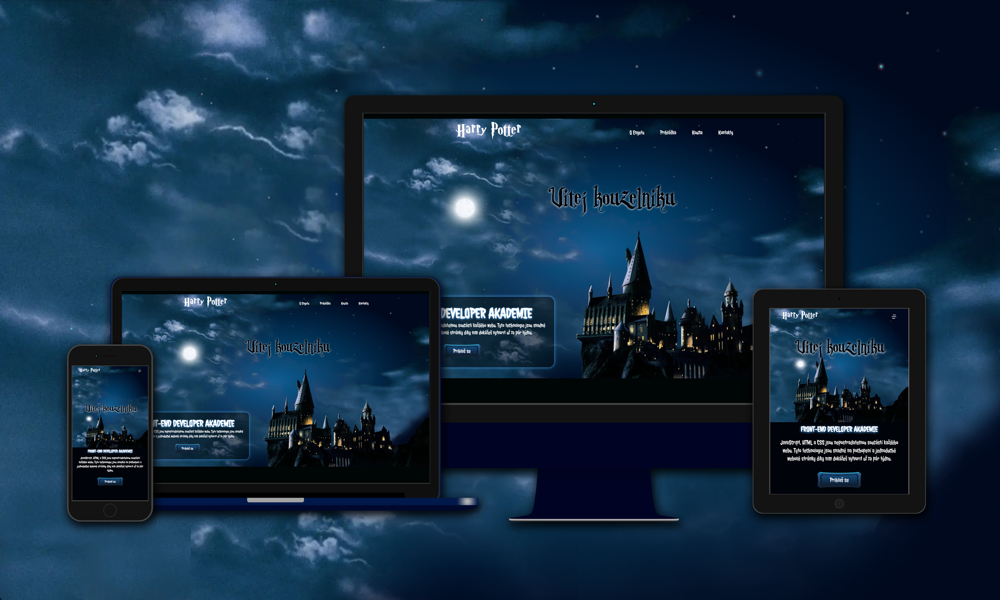

# Engeto Academy -project-2

Project #2 (HTML, CSS, JS) of Front-end developer Academy on Engeto.cz

This is a solution to the [Engeto Academy - Project 1](https://engeto.cz/webova-akademie/).

## Table of contents

- ➡️[Description](#description)
- ➡️[Specifications](#specifications)
- ➡️[Screenshot](#screenshot)
- ➡️[Live Site URL](#live)
- ➡️[Media Queries](#media-queries)
- ➡️[Author](#author)

## Description

The aim of this work is to practice knowledge with media queries and to prepare a so-called 'hamburger menu', which is a button that has a JavaScript property such that when clicked, the menu items are displayed. On larger screens like a laptop or desktop, this menu button is not displayed, and the menu items themselves are displayed. This behavior is managed by cascading styles in combination with simple JavaScript.

## Specifications

🟢 “Mobile-first” approach 📲  
🟢 Semantic HTML5 markup 
🟢 CSS custom properties 
🟢 Flexbox 
🟢 CSS Grid 
🟢 [Parry Hotter font](https://www.1001fonts.com/parry-hotter-font.html) - '<i>Parry Hotter font</i>' 
🟢 [Remixicon](https://remixicon.com/) - Open-source system of icons 
🟢 [GSAP](https://gsap.com/) - GSAP is an industry standard JavaScript animation library 
🟢 sticky navigation menu (show/hide) - only mobile devices 

## Screenshot

## Live

- Live Site URL: ➡️ [www. petrb-engeto-academy-2.netlify.app/](https://petrb-engeto-academy-2.netlify.app) ⬅️

### Media-queries

- small mobile: 0-330px
- mobile (default): 330-575px
- tablet: 575px - 799px / 575px - 799px and min-height: 600px;
- laptop: 800px - 1149px
- big screen: > 1150px

## Author

- Website - [Petr Bednarski](https://github.com/pettik)
- Frontend Mentor - [@pettik](https://www.frontendmentor.io/profile/pettik)

## Engeto Lecturer Evaluation

Congratulations, great job! You managed to meet our requirements, and your project has the status of **FULFILLED**.

Evaluator's rating: **FULFILLED**

**What I liked:** The student submitted the work with additional custom code. The student utilized the JS package for additional work. Well-structured code.

**Areas for improvement:** Comments in the code are relatively unnecessary; the code should be divided into functions and blocks so that it is immediately clear what the code does at any given time. Alternatively, it could be divided into multiple files or utilize OOP (which would be overkill in this case). Comments should only be used if absolutely necessary. They can then be used to document what each function does, its parameters, and its return value, especially if the method/function is reused in different files and the definition is not readily accessible. However, we should only describe what each function does if it's not already clearly defined, focusing on technical descriptions.

Lines 6-20 could have been resolved with a single if statement (if (navToggle || navClose)) and then using a ternary operator to distinguish whether to use navMenu.classList["add"] or ["remove"].

It's great that you're reusing some JavaScript library. Working with various packages is important; however, it's necessary to consider whether JavaScript is even needed for this, or if CSS animations would suffice. CSS animations are very simple and are suitable for at least 90% of cases when animating something. Using JS for animations is quite overkill.

**Conclusion:** The student clearly handled the project well, which was the point of this task. Good job!
